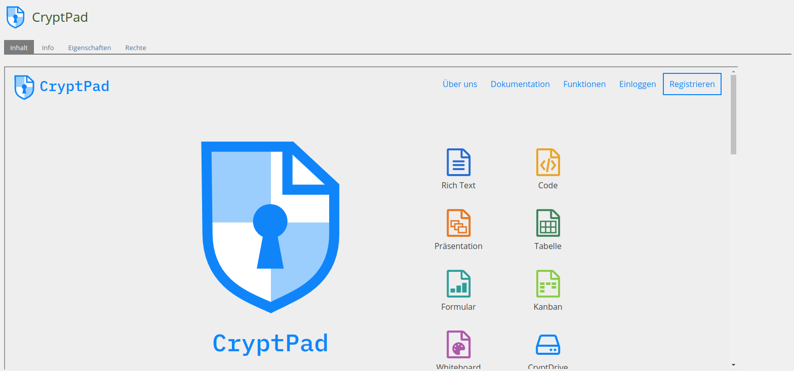
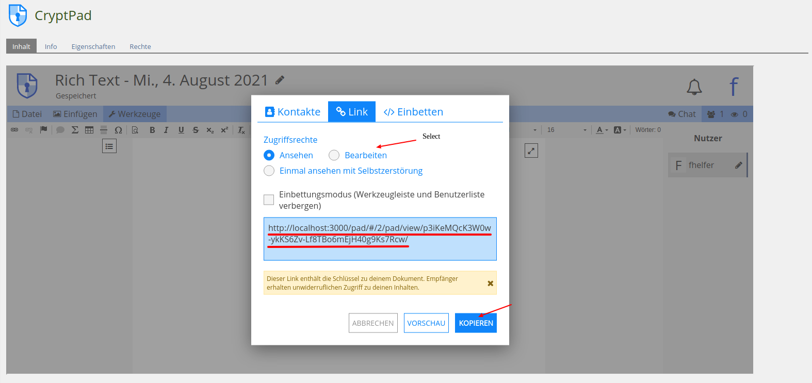
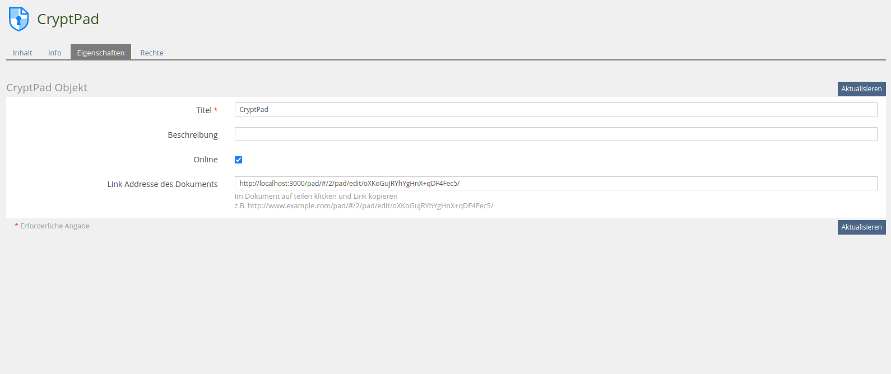
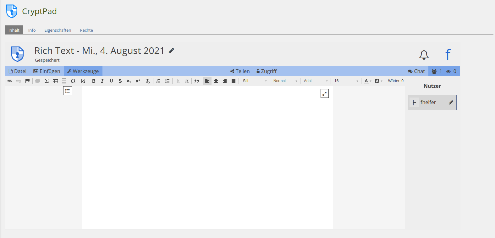
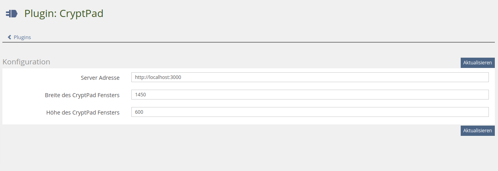

# ILIAS Plugin - CryptPad

ILIAS Repository Object Plugin 

## Table of Contents
* [Description](#description)
* [Requirement](#requirement)
* [Installation](#installation)
* [CryptPad Installation](#cryptpad-installation)

## Description
### What is CryptPad
CryptPad is a Open-Source, encrypted collaboration suite. Documents of the usual types (word, excel, powerpoint, ...) can be created and edited in collaboration with other users.

### What does CryptPad Plugin for Ilias?
CryptPad is a repository object plugin.  
Once installed, it can be added in the magazine.  
Before using it for the first time, an administrator should have set up a server via the Plugin configuration.  
The start page of Cryptpad is displayed the first time it is used. A document can be created here as required. The link can then be entered in the settings, which means that the created pad will now be displayed for all users with access to the object.

### Visual Guide
Startpage after adding the Object:

After creating a document link can be found here:

Add the link in Properties Tab:

Now the Document will be displayed in Content Tab:


### Configuration

Window size and server location can be configured for the plugin.

### Additional Information
User Management inside the Plugin controlled by Ilias is not possible. Users will have to log in themselves or edit their Anonymous name tag when working together in the document

## Requirement

* PHP: 

* ILIAS: 

## Installation

1. Clone this repository to **/Customizing/global/plugins/Services/Repository/RepositoryObject**
```shell
git clone https://gitlab.databay.de/fhelfer/CryptPad.git
```  
2. Enter the repository and do **composer install**
```shell
cd CryptPad
composer install
```  
  
3. Login to ILIAS with an administrator account (e.g. root)
  
4. Select **Administration -> Extending ILIAS -> Plugins**
  
5. Install **CryptPad** Plugin and activate
  
## CryptPad Installation

### Requirements:
* NodeJs
* npm
* bower
    * ```npm install -g bower```

### Installation
1. Clone CrypPad
```shell
git clone https://github.com/xwiki-labs/cryptpad.git
```
2. Install missing dependencies
```shell
cd cryptpad
npm install
bower install
```
### Configuration
* Copy default configuration
```shell
cd $cryptpath/config
cp config.example.js config.js
```
* For Configuration details visit https://docs.cryptpad.fr/en/admin_guide/customization.html
* Run CryptPad
```shell
npm run watch
or
node server.js
```
